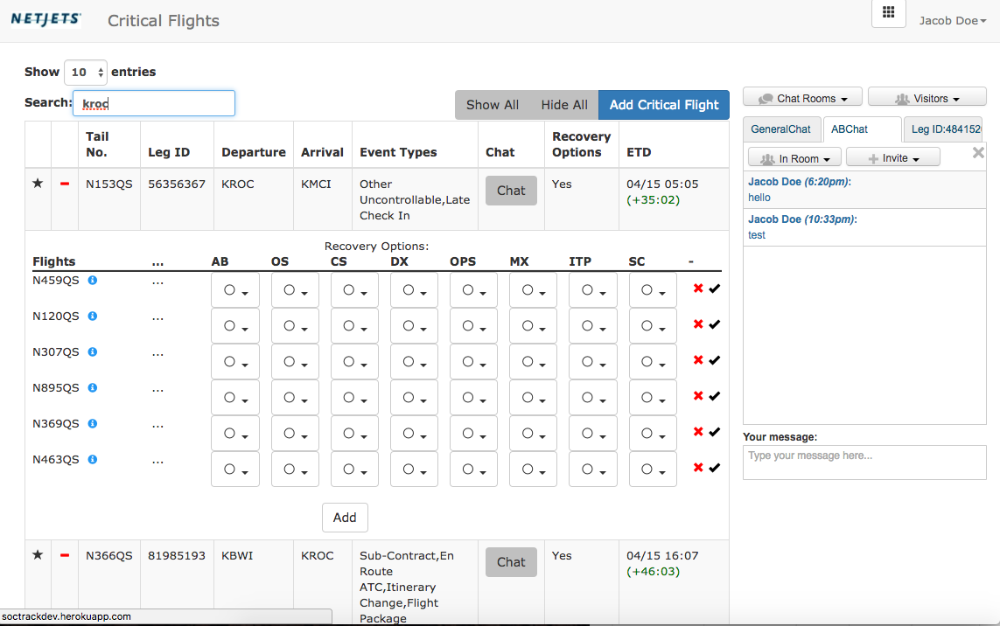
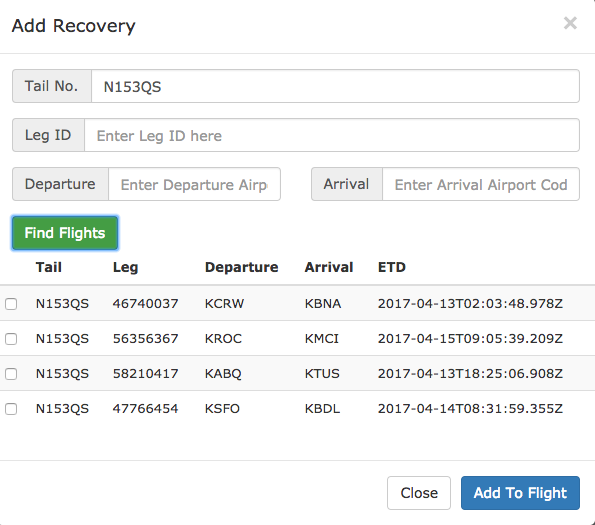
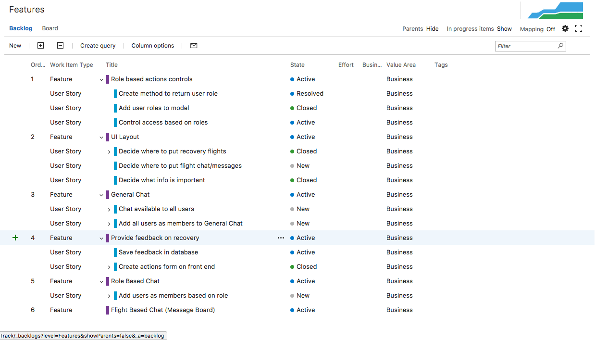
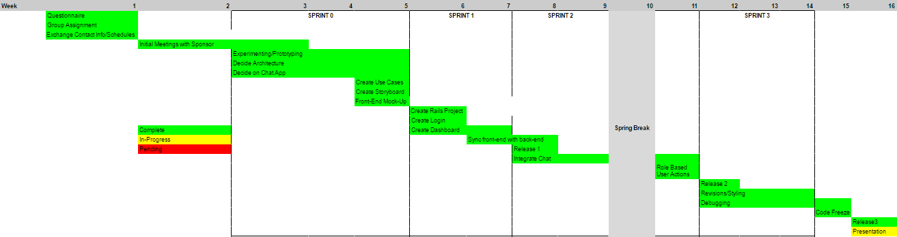
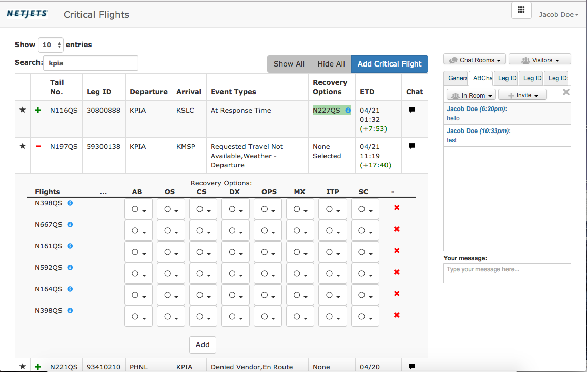
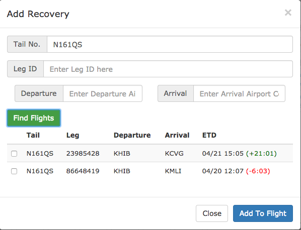
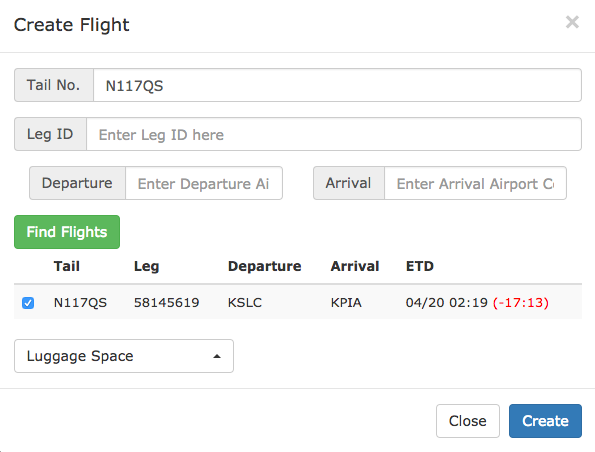
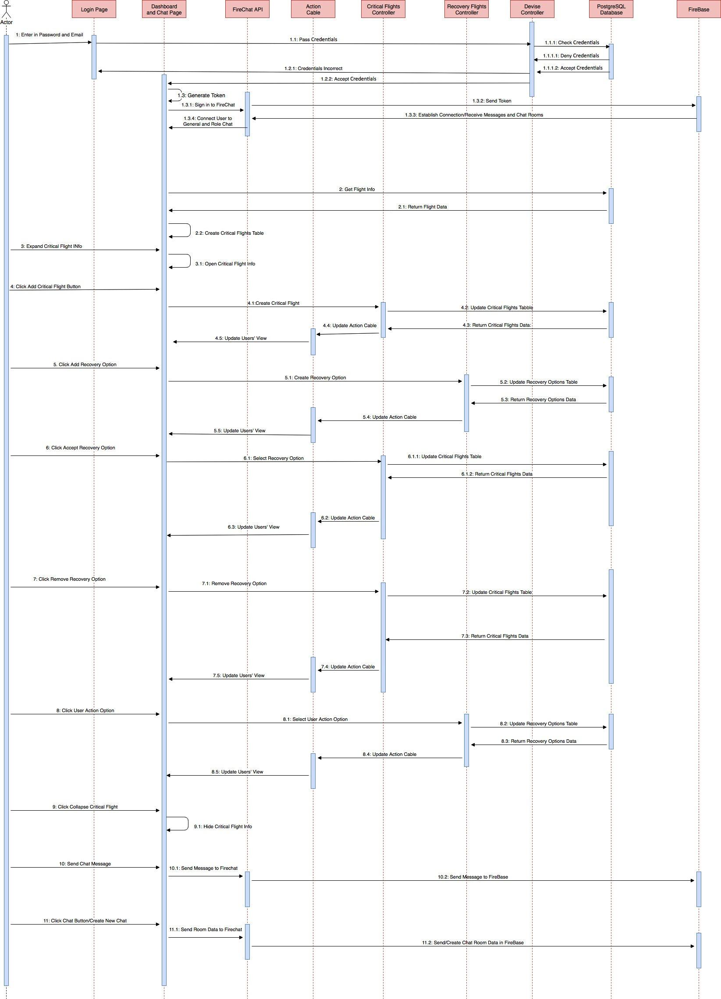
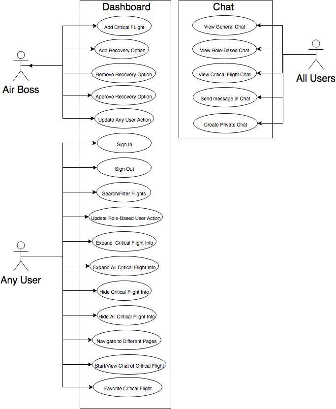

 

SOCTRACK DASHBOARD

Daniel Bedich, Shantanu Bhardwaj, Cyriac Thundathil, Asanka Nanayakkara


# SETUP INSTRUCTIONS

Enter soctrackdev.herokuapp.com in a compatible browser window. Login screen will then come up.

# INTRODUCTION

A subsidiary of Berkshire-Hathaway, NetJets is a private American company that sells shares or part ownership of private aircraft. Headquartered in Columbus, Ohio with European hub in Lisbon, Portugal, it was one of the premier private and charter airlines services in the world. Today NetJets leads the industry, providing services to over 325,000 flights to more than 160 countries and 4,000 airports across the world. Their philosophy stresses attention to detail, the highest safety standards, the latest technology, and transparency to customers. in order to provide fair, reliable, and prompt service.



PROBLEM STATEMENT

*"Our organization has hundreds of flights that are flown each day. We would like to build an application that is a dashboard of our critical flights, with ability to identify critical issues. And this tool shall have the ability for the SOC members to communicate among themselves to resolve critical issues. The application shall have the following features:*

a. Publish /subscribe functionality so that as the data changes, user’s screens are	updated immediately.
b. Tracking communication among SOC members and associating communications with key entities
c. Dashboard for flights to identify critical issues
d. Ability to search past communications"

The goal of our capstone project is to improve the current SocTrack dashboard application, both functionally and aesthetically. Our point of contact project was Umesh Vaswani, an architect. With him, we analyzed the functional requirements, current application, and points of improvement on the current application. He also advised us how to approach the project like software engineers in industry would. 

Based on what we gathered from our meetings with Umesh and our technological experience, we decided to construct and implement the SOC dashboard using Ruby on Rails 5.0. Initially we tried implementing an AngularJS-based front end but it could only interact with the back-end using HTTP requests, which would defeat the purpose of real-time updates. Rails 5.0 was an appealing choice because this version was the first to have the ActionCable framework, their version of websockets. Using this, we could easily implement real-time updates to our information.

In order to save time and redundant work, we applied external open-source libraries and plugins for our application’s functionality. Our login and security functionality was all handled by the Devise framework. Our table was built by DataTables. Finally, our communication/chat platform was implemented through FireChat.

# FUNCTIONAL REQUIREMENTS

1. Table showing information on critical flights with attributes such as tail number, leg ID, departure, arrival, event types, recovery options, and ETD with sortable headers

2. Expandable portion on table to show recovery options

3. Ability to create and select recovery options for a flight. Once a flight is selected as a recovery option, it should not be a valid option for any other flight.

4. Ability for users to approve recovery options through the table 

5. Embedded chat in which users can chat others attached to that flight or others with the same role

6. Real-time updates to that changes are immediately notified to logged in users.

7. Ability to mark favorite flights

8. Different user roles should have different permissions.

# NON-FUNCTIONAL REQUIREMENTS

1. Appealing color scheme and NetJets branding

2. Fast response post login

3. Ability to move chat window

4. Time displayed in a meaningful format

5. Ensure there are no limits of the number of users per role to promote scalability

# CODE AND TEAM MANAGEMENT

In order to best manage our project and allow us to collaborate on changes, we first put our Rails application on github, since we were all familiar with using it. We used strict branching in order for seamless merges. We had a develop branch which branched off the master branch that held code that was functioning working code. Each feature had a branch off of develop that contained working code for that individual feature. This prevented people’s changes from adversely affecting the whole project.

In order to assign tasks and track their progress, we initially tried Trello but later opted to switch to Visual Studio Team Services due its ease. Communication between group members were through a dedicated GroupMe room.

In order to make sure we were going in the right direction, we met with Umesh once every week at NetJets to provide updates on our progress. He always gave us input and advice on what we had. These weekly meetings also served as an opportunity to discuss and update the requirements if need be.

Cyriac served as the project manager of the team. Being the most experienced with Rails 5.0, he took the initiative on setting up the back-end, optimizing the code, linking it with the front-end and initially populating it with mock data. He also assisted with the front-end and Fire Chat implementation when needed. After the code freeze, he took the initiative on starting with unit and integration testing using Minitest.

Asanka Nanayakkara assisted Cyriac in the back-end, helping establish ActionCable functionality to the project in order for real-time updates. He also managed the team’s documentation, continuously updating it. After the code freeze, he helped with user-acceptance testing.

Shantanu and Daniel took the initiative to set up the application’s front end. Initially they attempted to set it up using Angular but switched to javascript, Jquery, and DataTables due to compatibility issues. They also lead the initiative on optimizing the application and setting up the Fire Chat service. After the code freeze, they mainly focused on fixing the application of any bugs found.

# STORY CARDS & EPICS



One epic was made for our 3 main features: the physical and visual dashboard itself, the chat functionality, and the user management.



Purple bars show individual features, each which contain cyan bars, the stories.



Our first sprint was three weeks long. During this period, we first met with our sponsor, assigned our roles within the team, and decided on our architecture and platform for the dashboard.

Our second sprint was two weeks which involved making the foundation of our project. The rails back-end as well as the login page and front-end were created.

Our third sprint was three weeks. We finished connecting the front-end and back-end and this spring culminated with the first release. Role-based user actions and permissions were also implemented. 

Our three-week fourth sprint involved integrating the chat as well as final debugging, testing, and styling tasks. This culminated in a code freeze during which more debugging and testing were conducted.

# RISK AVOIDANCE & MITIGATION

Throughout the project, we faced varying degrees of risk. As a team, we learned to avoid, manage, and mitigate risk at every step of the way.

1. RISK: Not finishing the project in time

    1. Set clear timelines and deadlines for the team.

    2. Met regularly with the sponsor to share progress and get advice.

    3. Took advantage of spring break, class work days, and the weekends to work on project.

    4. Assigned team members to areas based on their strength. Members also offered to help each other when needed.

2. RISK: Changing of requirements

    5. Met regularly with sponsor to ensure that the project was going in the intended direction.

    6. Obtained clear requirements and expectations early on from the sponsor.

    7. Made clear our abilities and experience to our sponsor to avoid potential last-minute requirement changes.

3. RISK: Learning new features of Rails 5.0

    8. Read online guides on ActionCable and Rails from Michael Hartl.

    9. Asking Cyriac, who has extensive Rails experience, for assistance. 

4. RISK: Implementing a third-party chat service using unfamiliar API’s.

    10. Read/watched any available documentation and tutorials available. 

# MAIN SCREEN

Figure 1: Main Screen

# TUTORIAL

1. Searching for a flight:

    1. Type in any of the properties of the flight in the search bar (not case-sensitive). Flights matching entered parameters should populate while typing.

2. Viewing available recovery options:

    2. Search for desired flight.

    3. Click the "plus"sign between the start and tail number. This will expand that flight and the recovery flights will be displayed below. Different users can also approve, deny, or update the status of a specific recovery option here.

    4. Alternately, you may click the "Show All" button at the top right of the table and all flights should be expanded. Searching for the flight should retrieve the expanded flight with the recovery options already displayed. (See Figure 2).

Figure 2: Main Screen Expanded 

1. Creating a recovery option: 

    1. Find desired flight.

    2. Expand flight

    3. Click "add"

    4. Enter information about flight. If you just enter the valid tail number and hit "find flights", a list of available flights will be retrieved. Select desired flight.

    5. Click "Add to Flight" to add recovery option. Then click “Close” when finished. See Figure 3.



Figure 3: Add Recovery Flight Page

1. Joining a chat for a certain flight.

    1. Role based and general chat rooms are automatically joined upon login. 

    2. To communicate with others assigned to a specific flight, search for the desired flight on the table.

    3. Click on the speech bubble icon for that flight on its row. You should know be added to that flight’s room.

2. Adding a critical flight

    4. Click the blue "Add Critical Flight" button at the top-right corner of the table. 

    5. Enter in the desired tail number and click the "Find Flights" button.

    6. Available flights will be displayed at the bottom. Select the desired one. Select the events using the drop-down menu. Close the window. 

    7. You will be prompted to update the table (blue notification at the top of the table) in order for the flight to be visible to all users. 

Figure 4: Add Critical Flight Page

# ARCHITECTURE

# SEQUENCE DIAGRAM



# TESTING

For testing, we utilized Minitest, a ruby testing tool. Minitest was used to test the backend. Also, both members of our team, and our sponsor did user-acceptance testing with the application on Heroku in order to test the front end. Minitest was used to test the models, controllers, rails routes, and other configurations used in by rails. Minitest was used to check if database rules put into place will be enforced by the controllers. YAML files were used to create mock data and then used for the testing. 
```
   setup do
     @flight = flights(:one)
   end
   test "should get index" do
     get flights_url
     assert_response :success
   end
   test "should create flight" do
     assert_difference('Flight.count') do
       post flights_url, params: { flight: { arrival: @flight.arrival, departure: @flight.departure, etd: @flight.etd, leg: @flight.leg, tail: @flight.tail } }
     end
     assert_redirected_to flight_url(Flight.last)
   end
   test "should show flight" do
     get flight_url(@flight)
     assert_response :success
   end
 End
 class CriticalFlightsControllerTest < ActionDispatch::IntegrationTest
   test "should get index" do
     get critical_flights_url
    assert_response :success
   end
   test "should create critical_flight" do
     assert_difference('CriticalFlight.count') do
       post critical_flights_url, params: { critical_flight: { event: @critical_flight.event } }
     end
     assert_redirected_to critical_flight_url(CriticalFlight.last)
   end
   test "should get edit" do
     get edit_critical_flight_url(@critical_flight)
     assert_response :success
   end
   test "should update critical_flight" do
     patch critical_flight_url(@critical_flight), params: { critical_flight: {event: @critical_flight.event} }
     assert_redirected_to critical_flight_url(@critical_flight)
   end
   test "should destroy critical_flight" do
     assert_difference('CriticalFlight.count', -1) do
       delete critical_flight_url(@critical_flight)
     end
     assert_redirected_to critical_flights_url
   end
 end
```
# USE CASE DIAGRAM

KNOWN BUGS/DEFECTS

1. User is able to add multiple of the same recovery flight option to a critical flight. 

2. The "favorites" feature saves for each user but upon reloading the page, the favorite is no longer saved.

3. Accepting a recovery option will not lock that option out for other critical flights.

4. The code does not check the time of the selected recovery option to see if that option is even feasible.

5. User cannot de-select a recovery option.

# OVERALL ASSESSMENT & FUTURE WORK

Overall, we were able to make an aesthetically appealing and functional SocTrack application that has potential for deployment. Though we had the aforementioned bugs, none of the bugs affected the actual functionality of the application. 

In retrospect, there are a number of things that could have been done to follow better coding practice. First, periodic code reviews should have been done in order to ensure code functionality and quality. Second, test-driven development would ensure that our code functions as it should and would have made testing a lot easier and smoother. Finally, actually using the storyboard would ensure that we were staying organized and on schedule. By implementing these three practices, we would be following better agile practices.

Future work, if given more time, would be to fix the aforementioned bugs, which we are confident can be done. Being able to log chats in order to view them later would be a very useful feature as well. Also if given the opportunity to continue this project,  additional tasks would include testing our application with actual data from NetJets.  Testing our application with additional testing frameworks such as Cucumber would provide peace of mind before deploying our application in a production environment Furthermore, more collaboration and acceptance testing by the SocTrack team at NetJets would help improve this application for potential deployment.

# ACKNOWLEDGEMENTS

We would like to thank the Ohio State University Department of Computer Science & Engineering, Perumal Ramasamy, and NetJets for the opportunity to do this project. We would also like to thank Umesh for his continued advice and mentorship throughout this project.

# REFERENCES

Ruby on Rails:

	- http://guides.rubyonrails.org/

jQuery

	- https://api.jquery.com/

jQuery DataTables

	- https://datatables.net/

	- https://datatables.net/docs/DataTables/1.9.4/DataTable.html

Firechat

	- https://firechat.firebaseapp.com/docs/

	- https://github.com/firebase/firechat

Firebase

	- https://firebase.google.com

	- https://firebase.google.com/docs

	- https://console.firebase.google.com

		Email: soctrackdev@gmail.com

		Password: sp17dashboard

		Contains all data from firchat (users, rooms, messages)

ActionCable

	- http://edgeguides.rubyonrails.org/action_cable_overview.html

	- https://www.learnenough.com/action-cable-tutorial#sec-upgrading_to_action_cable

MiniTest

	- http://ruby-doc.org/stdlib-2.0.0/libdoc/minitest/rdoc/MiniTest.html

	- https://github.com/seattlerb/minitest

